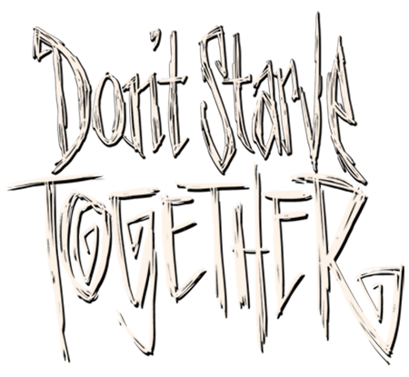

<p align="center">

<h2 align="center">Docker饥荒联机版专用服务器</h1>
</p>

<p align="center">
  <a href="./LICENSE">
    
  </a>
  <a href="https://github.com/purity3">
    
  </a>
</p>

本项目改造自 [Jamesits](https://github.com/Jamesits) 大佬[
docker-dst-server](https://github.com/Jamesits/docker-dst-server)，个人学习 Linux 的练手项目。可以帮助饥荒联机版玩家通过 docker 快速生成及管理自己的服务器。

## 项目特点

在原版`docker-dst-server`的基础上增加了以下特点：

- 🔧 优化`Klei` `V1` 和 `V2-ugcMods` mod 加载不全问题，[详情查看](https://forums.kleientertainment.com/forums/topic/128188-what-is-ugc/?do=findComment&comment=1440420)
- 📃 提供 [岛屿冒险](./configs/clusters/IslandAdventure/) 和 [原版饥荒](./configs/clusters/Origin/)多套模板，如对 Mods 模板有改造需要，可新增目录进行替换后通过`Dockerfile`重新构建镜像，模板目录如下
  ```bash
  ├── clusters            # 配置模板存放地
  │   ├── YourTemplate    # 模板名称，后续作为环境变量引入
  │   │   ├── Caves
  │   │   │   ├── leveldataoverride.lua # 地形生成文件
  │   │   │   └── server.ini
  │   │   ├── Master
  │   │   │   ├── leveldataoverride.lua  # 地形生成文件
  │   │   │   └── server.ini
  │   │   └── mods
  │   │       ├── dedicated_server_mods_setup.lua # 模板需要安装mod
  │   │       └── modoverrides.lua  # 模板相关设置
  │   ├── adminlist.txt
  │   ├── blocklist.txt
  │   ├── cluster.ini
  │   └── whitelist.txt
  └── mods
      ├── dedicated_server_mods_setup.lua # 搭建服务器公共mods
      └── modsettings.lua
  ```

## 硬件系统要求

- 确保你的安装环境是 Linux `x86_64` or `amd64`，Docker 版本不低于 `18.05.0-ce`， 可通过以下命令查看

  ```bash
  # 查询Linux内核
  arch # 输出结果为x86_64 amd64，如果是arm就放弃吧

  # 查询Docker版本
  docker -v #大于18.05.0-ce就行
  ```

- 确保服务器有公网 ip（购买某云基本都有）
- 防火墙注意放行一下 udp 端口
  ```bash
    10999-11000 12346-12347
  ```
- **CPU** 地上洞穴每个 1 核，建议使用主频较高 cpu，典型 1 核有难 8 核围观，如果
  多开 docker 建议给 docker 分配内核
- **内存** 地上洞穴每个 2G，每个玩家还得分配 60M
- **硬盘** 推荐给 5G 以上的空间

## 如何开始服务

请按照以下步骤来实施，详请可看这个[大佬操作](https://wuter.cn/209.html/)

### 步骤一：获取令牌

steam 登录[keil 饥荒联机版服务器创建页](https://accounts.klei.com/account/game/servers?game=DontStarveTogether)配置服务器，复制`pds-*******`开头的令牌文件

### 步骤二：创建存档目录

饥荒存档格式基本与本地存档一致，若已有存档目录默认读取`Cluster_1`的存档，若未生成则根据变量`DST_TEMP_CLUSTER`（默认值是`IslandAdventure`）对应的模板生成存档目录，
如何获取存档目录请[查看详情](https://dontstarve.fandom.com/zh/wiki/%E5%A4%9A%E4%BA%BA%E7%89%88%E9%A5%A5%E8%8D%92%E7%8B%AC%E7%AB%8B%E6%9C%8D%E5%8A%A1%E5%99%A8#%E5%90%AF%E5%8A%A8%E5%8F%82%E6%95%B0)，
存档格式为

```bash
├── DoNotStarveTogether
    └── Cluster_1
        ├── Caves
        │   ├── leveldataoverride.lua
        │   ├── modoverrides.lua
        │   └── server.ini
        ├── Master
        │   ├── leveldataoverride.lua
        │   ├── modoverrides.lua
        │   └── server.ini
        ├── mods
        │   └── dedicated_server_mods_setup.lua
        ├── cluster.ini
        ├── cluster_token.txt
        ├── adminlist.txt
        ├── blocklist.txt
        └── whitelist.txt
```

### 步骤三：启动及管理服务器

分为`docker`直接运行或`docker-compose`管理运行，推荐`docker-compose`管理。地上和洞穴基于`supervisor`托管，`supervisor`相关命令均可用

#### 方式 1：docker 启动

```bash
# 构建镜像
cd dst-dedicated-server \
&& docker build . -t dst-server:latest

# 启动docker服务器
docker run -d \
    --name dst-server
    -v <YourDSTClusterDir>:/data \
    -p 10999-11000:10999-11000/udp \
    -p 12346-12347:12346-12347/udp \
    -e "DST_SERVER_ARCH=amd64" \
    -e "DST_CLUSTER_TOKEN={YourDSTClusterToken}" \
    -e "DST_TEMP_CLUSTER={IslandAdventure|Origin|<YourAddTemp>}"
    -e "DST_UPDATE_TIMES=2" # 某些大型mod一次可能更新不完，因此提供了2次以上的更新
    -it dst-server:latest
```

#### 方式 2：docker-compose 启动

直接参考本项目配置文件`cp .env-example .env`，进入编辑`.env`

```bash
    # 存档位置
    DST_CLUSTERS_PATH=<YourClustersDir>

    # 服务器令牌，复制你获取到的饥荒令牌
    DST_CLUSTER_TOKEN=<YourClustersToken>

    # 选择一个你希望生成的模板，默认就是IslandAdventure
    DST_TEMP_CLUSTER=IslandAdventure

    # Mod更新次数，至少要为2，有的大型mod可能下载不全
    DST_UPDATE_TIMES=2

```

然后通过 docker-compose 来管理服务器的启动、关闭及构建等

```bash
    # 构建镜像及启动服务
    docker-compose up -d dst-server

    # 启动服务器
    docker-compose start dst-server

    # 查看服务器日志，可加grep过滤
    docker-compose logs dst-server

    # 停止服务器
    docker-compose stop dst-server

    # 移除服务器
    docker-compose down dst-server

    # 查看服务器状态，start启动中，healthy运行正常
    docker-compose ps

    # 更多你们可以自己去研究啦
```
#### docker启动中涉及到的参数
| 参数                 | 参数说明                                                                          | 是否必填 | 默认取值 |
| :------------------- | :-------------------------------------------------------------------------------- | :------: | :------: |
| `DST_CLUSTERS_PATH`  | 用于标记存档位置，路径使用绝对路径                                                |    ✅     |  `null`  |
| `DST_SERVER_ARCH`    | 根据Linux系统版决定启动使用`/bin`还是`/bin64`                                     |          |  `x86`   |
| `DST_CLUSTERS_TOKEN` | 服务器令牌，启运行服务器的关键                                                    |    ✅     |  `null`  |
| ` DST_TEMP_CLUSTER`  | 没有设置存档时默认加载的模板，默认有`IslandAdventure` `Origin`                    |          | `Origin` |
| ` DST_UPDATE_TIMES`  | 每次启动前服务器需要更新mod 的频次，建议最少为3，低于3可能mod未下载全就启动服务器 |          |   `3`    |
## 游戏模板
项目预装热门模组，用户按需使用，注意`mod兼容情况`
- [岛屿冒险](https://dsthainan.notion.site/dsthainan/mod-wki-8d542f1a5bf543cdbf24422a36b581e8)：高度还原单机版海难

## 后续计划
- 提供服务器增加黑白名单、管理员权限运行指令
- 单层世界开服管理，可通过创建多个容器来组成多世界
## 开发人员
`purity3`

## 鸣谢
[Jamesits](https://github.com/Jamesits)

## License
[](./License)

## 参考材料
- [
docker-dst-server项目](https://github.com/Jamesits/docker-dst-server)
- [What is UGC](https://forums.kleientertainment.com/forums/topic/128188-what-is-ugc/?do=findComment&comment=1440420)
- [饥荒官方Linux搭建教程](https://forums.kleientertainment.com/forums/topic/64441-dedicated-server-quick-setup-guide-linux/)
- [wuter搭建服务器教程](https://wuter.cn/209.html/)
- [岛屿冒险模组](https://dsthainan.notion.site/dsthainan/mod-wki-8d542f1a5bf543cdbf24422a36b581e8)
- [饥荒维基百科](https://dontstarve.fandom.com/zh/wiki/%E5%A4%9A%E4%BA%BA%E7%89%88%E9%A5%A5%E8%8D%92%E7%8B%AC%E7%AB%8B%E6%9C%8D%E5%8A%A1%E5%99%A8#%E5%90%AF%E5%8A%A8%E5%8F%82%E6%95%B0)